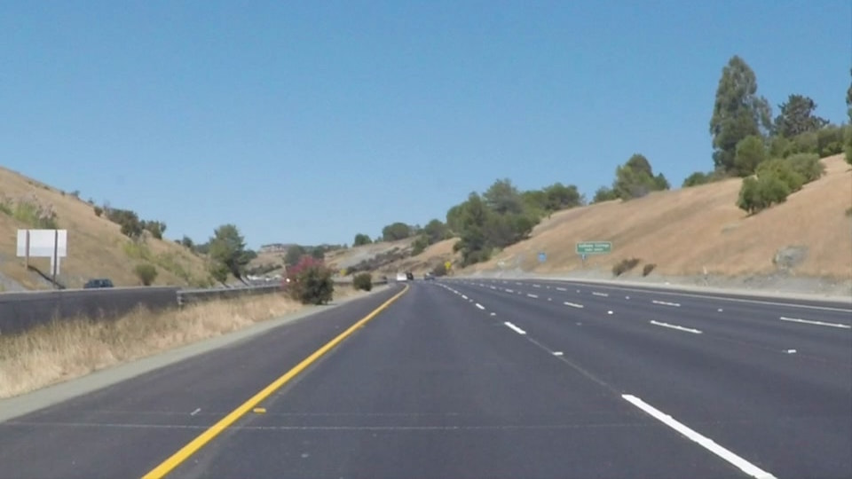

# **Finding Lane Lines on the Road** #

**Finding Lane Lines on the Road**
---

### Reflection

### 1. Pipeline
<!-- Describe your pipeline. As part of the description, explain how you modified the draw_lines() function. -->

My pipeline consisted of 5 steps.
1. Step 1: convert the image to grayscale
2. Step 2: apply canny edge detector on grayscale image to obtain edge-detected image
3. Step 3: obtain region of interest by applying a mask image defined by heuristically-chosen polygons
4. Step 4: apply hough transform on output of step 3 to get lines
5. Step 5: sort lines obtained from step 4 into two categories: lines on left lane and lines on right lane; then calculate average lines of each category. These two average lines will represent left lane line and right lane line.

Sample image of each step can be seen in the figures below.

- Original Image:

- Step 1: Grayscale Image

- Step 2: Edge image by canny edge detector:

- Step 3: Segmented image:

- Step 4: Lines from hough transform:

- Step 5: Average lines:

Output of step 5 will yield a single line on the left and right lanes.
I also created a detector class call LaneLineDetector that holds all the processes described in step 1 to 5. To use this class, inside draw_lines(), an instance of LaneLineDetector is created with the image input; then draw\_overlayed\_lines() method of LaneLineDetector iscalled to get the final output image overlayed with sigle left and right lane lines.

### 2. Identify potential shortcomings with your current pipeline

In the current approach, after sorting lines into two categories of left lane lines and right lane lines; a simple process of calculating the average of each category was utilized to obtain single line on the left and the right. This will easily fail if there is noise detected as lines in the region of interest; which make the averaged line moves far away from the real lane line.

### 3. Suggest possible improvements to your pipeline

A possible improvement would be to apply a more sophisticated fitting a polynomial model like RANSAC line fitting; instead of the simple average method.
